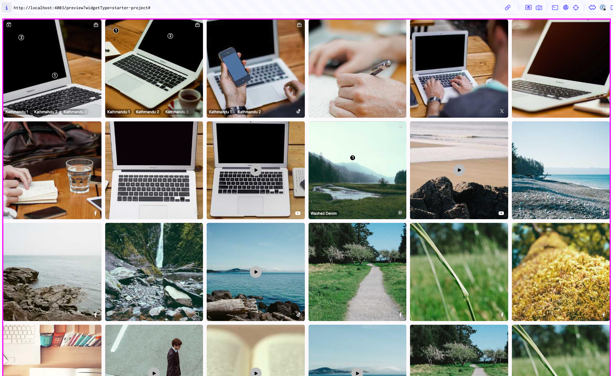

# Starter project activity

This project has been created with the sole purpose of:

1) Allowing you to see what is possible with widgets
2) A space for you to follow the activity provided to learn about how you can customise widgets with ease

## Getting started with the activity

1) Run npm run start & access http://localhost:4003/preview?widgetType=starter-project
2) You will notice this widget is bouncing without end! Its driving us mad. Please put it to an end.
3) Why is the widget in a circle? Please remove the circle and ensure it is in a grid format, covering all sides of the screen.
4) The border of the circle is based on the mood given to the method. Please update it so that it is using 'nosto' mood with a pink border to represent Nosto.

A successful attempt at this activity will be something like the following.

But most importantly, have fun!